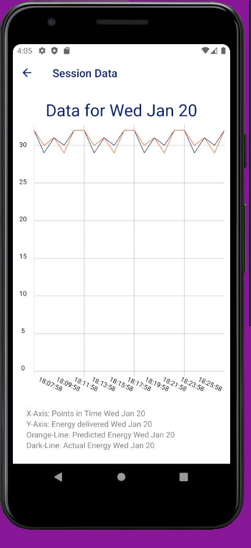

# chargeTracker

*Preemptive warning: Due to the absence of a Mac, this app has only been tested on Android Emulators.*
 

**This app is a sample charging tracker app for users to see their charging session data, and update their charging preferences built using React Native Expo.**

 

The app has 4 different screens:
 
* The landing screen: This is the first screen the user sees after opening/launching the app. Here the user can choose whether to access the session data or the preference screen. Both of these paths are accessible via a button. Using the POST-method I am submitting the preferences of the user to the following API: https://dev.powerflex.io/test-server/preferences

 

* The PreferenceScreen: Here the user can record preferences. The fields which are captured and Posted to the server are:
1.)	Miles Needed 
2.)	Charge Duration 
3.)	Make 
4.)	Model 
5.)	Year 
6.)	Mileage 
7.)	Battery Size

* SessionScreenOverview: In this screen all the available sessions are automatically displayed. The user can choose the session for which the graph should be displayed. The id of the chosen session will be passed on to the next screen the “SessionScreen”. It retrieves the information about the possible sessions from the following API: https://dev.powerflex.io/test-server/sessions/ In this screen I use the fetch API in conjunction with the GET-method to access the information.

 

* SessionScreen: The SessionScreen gets the id of the chosen session by SessionScreenOverview. A single graph plots all of the user’s session data of the chosen session. It retrieves the information about the particular session from the following API: https://dev.powerflex.io/test-server/sessions/${id}  In this screen I use the fetch API in conjunction with the GET-method to access the information. To display the chart I am using the library: react-native-svg-charts (https://github.com/JesperLekland/react-native-svg-charts) In order to be able to use it, another library has to be installed: react-native-svg (https://github.com/react-native-svg/react-native-svg). The line chart does then display these two data sets over time. The X-Axis shows the points in time when the energy was delivered. For better readability I decided not to show every time marker on the X-Axis, but rather only every second. 

